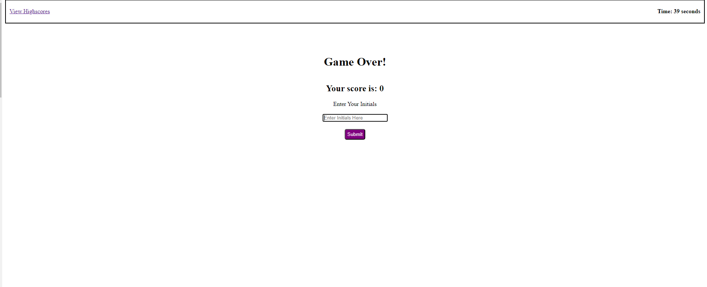

# Coding-Quiz
# Description
This repository is for an application that builds a timed quiz.
The application was created in order to provide a quiz to test a users knowledge. It will help the user gauge how well they are doing compared to their peers with regards to coding knowledge. It gives the user a score that can be used to compare to the scores of other users. As a software developer, from creating this application, I was able to test my understanding of more advanced Java Script functions.g

# Usage
In order to use this application, first, you will need to go to the application landing page which can be found here https://kevalpatel6.github.io/Coding-Quiz/. Then you will need to read the instructions and click on start quiz, which will start the timer and render the first question. 

You will answer the rendered question on the page by clicking the answer that you believe to be the correct answer. For every correct answer the user will be given a score of +1. For every wrong answer the timer will reduce by 5 seconds. The choice that the user selects will be shown to be correct or wrong based on the selected answer. Below you can see a screenshot showing if the user was correct or wrong on the previous question.

If the timer runs out to 0 or you end the quiz, you will be taken to a Game Over Screen where you can input your initials where it will be saved on a HighScore page. Below you can see a screenshot of this.

# Credit

Credit to my tutor Joem Casusi for helping me with saving and loading from local storage. 

# License
MIT License

Copyright (c) [2023] [Keval Patel]

Permission is hereby granted, free of charge, to any person obtaining a copy of this software and associated documentation files (the "Software"), to deal in the Software without restriction, including without limitation the rights to use, copy, modify, merge, publish, distribute, sublicense, and/or sell copies of the Software, and to permit persons to whom the Software is furnished to do so, subject to the following conditions:

The above copyright notice and this permission notice shall be included in all copies or substantial portions of the Software.

THE SOFTWARE IS PROVIDED "AS IS", WITHOUT WARRANTY OF ANY KIND, EXPRESS OR IMPLIED, INCLUDING BUT NOT LIMITED TO THE WARRANTIES OF MERCHANTABILITY, FITNESS FOR A PARTICULAR PURPOSE AND NONINFRINGEMENT. IN NO EVENT SHALL THE AUTHORS OR COPYRIGHT HOLDERS BE LIABLE FOR ANY CLAIM, DAMAGES OR OTHER LIABILITY, WHETHER IN AN ACTION OF CONTRACT, TORT OR OTHERWISE, ARISING FROM, OUT OF OR IN CONNECTION WITH THE SOFTWARE OR THE USE OR OTHER DEALINGS IN THE SOFTWARE.